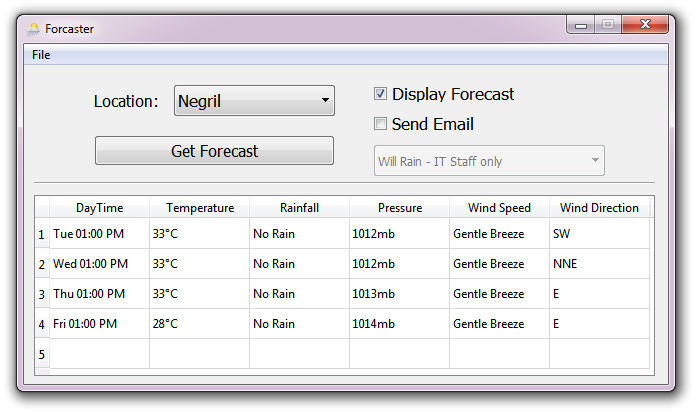

# Technical Evaluation

This program was given to me by a company to test my technical skills. It's now completed but I still make updates to it for personal development so I decided to make it open source in case someone wants to collab with me on it. 

# The Problem

Grace Gennedy has an employee workforce of 500 (200 in Mobay, 300 in Kingston) manufacturing workers. The boss man has realized that when it rains productivity is generally low for the following reasons:

*	People don't show up for work

*	People get to work late


The IT guys work on the street so they tend to get stuck a lot on the road, thus halting other things. There is a structure (db/file/something) with all the workers, the structure contains name, address1, city, country, telephoneNo, role, email.

The boss has the following criteria:

*	If it’s going to be a rainy day he sends a notification to affected employees (i.e. his city) with a schedule change - effectively, they're only working 4 hours today and not the usual 8 hours

*	If it’s sunny then an email is sent to the employee to let them know they're scheduled for 8 hours tomorrow  

*	If it's going to rain any day then the IT personnel should get an email from the boss explaining that they shouldn't hit the streets


The boss enjoys DVM weather forecast with Martia-May Levans in the evenings but sometimes he doesn't catch it and is unable to send notifications are required.
The boss has asked you to build an application that will check the weather forecast for the next 5 days and automate the sending of emails out to staff. You can create a structure and put some forecast data or pull it from an external source such as http://openweathermap.org/A PI. Use your discretion.

# Requirements 
* Python 3.x
* BeautifulSoup
* Texttable
* SQLite Manager (optional)

# Installation
```
$ pip install beautifulsoup4
$ pip install texttable
```
[Watch this video](https://www.youtube.com/watch?v=yKDzj70fNeg) to see how to get SQLite Manager. **You'll only need this if you intend on viewing or making changes to the database.**

# Execution 

1. Clone this repo
```
$ git clone https://github.com/Lithium95/WeatherWatch-TechnicalEval
```

2. Insert location you wish to get the forecast of. (See supported areas.txt)
```
location = WeatherForcast("XXXXXXXXXXXX")
```

3. Run Driver.py
```
$ python Driver.py
```

# UPDATES
There is now a basic GUI for this application:


This program now supports more than just Kingston and Montego Bay. 
See newly supported locations below:
* Kingston
* Spanish Town
* Portmore
* Morant Bay
* Port Antonio
* Port Maria
* Ocho Rios
* Falmouth
* Montego Bay
* Negril
* Savanna-la-mar
* Santa Cruz
* Mandeville
* May Pen
